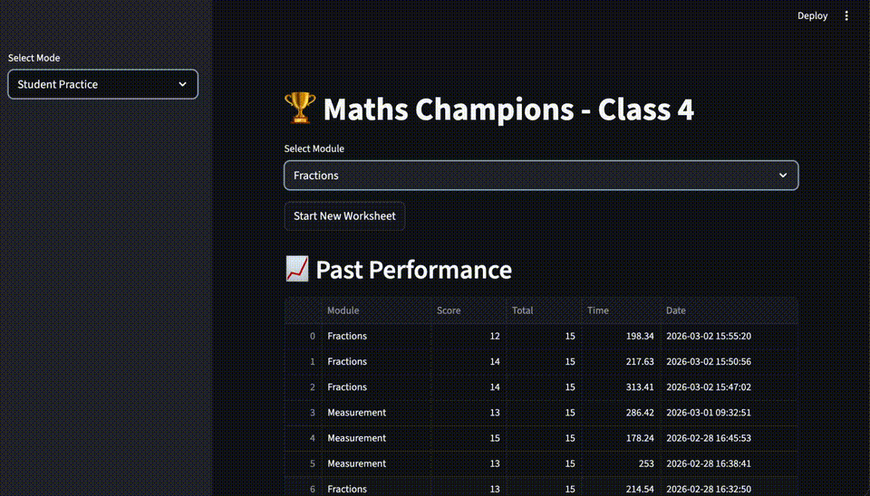

# Maths Champions

A Streamlit-based math practice app with class and chapter selection, timed worksheets, instant feedback, and a parent dashboard. Class 4 chapters and the first five Class 5 chapters are available. Further chapters will be added from the supplied curriculum.

## Demo



## Features

- Student practice mode with class selection and balanced chapter worksheets
- Class 4 chapters:
  - Fractions
  - Measurement
  - Perimeter & Area
  - Time
- Class 5 chapters:
  - Large Numbers
  - Addition, Subtraction and Their Applications
  - Multiplication, Division and Their Applications
  - Multiples and Factors
  - Fractions
- Question types:
  - Multiple choice
  - True/False
  - Fill in the blank
- Live timer per worksheet
- Answer feedback stays visible until Next Question; submitted answers are locked
- Worksheet review after completion
- Confirmation before restarting or exiting an unfinished worksheet; cancelling preserves progress and draft answers
- Parent dashboard (PIN-protected)
- Progress and score history tracking

## Tech Stack

- Python
- Streamlit
- Pandas
- SQLite (local file database)

## Project Structure

- `app.py` - Main Streamlit app
- `curriculum/__init__.py` - Registry of classes and their chapters
- `curriculum/class_4/` - Existing Fractions, Measurement, Perimeter & Area, and Time modules
- `curriculum/class_5/` - Class 5 chapter registry and individual chapter modules
- `fraction_answers.py` - Exact fraction parsing and answer-form validation
- `answer_validation.py` - Explicit numeric, quotient/remainder, number-name, ordered-list, and Roman answer matching
- `tests/` - Curriculum, migration, app-flow, and chapter arithmetic checks
- `db.py` - SQLite score storage helpers
- `progress.py` - JSON progress persistence and badges
- `utils.py` - Timer helpers

## Class 5: Large Numbers

Each standard worksheet has 15 questions covering:

- Indian and International place value charts, with a missing digit to fill in.
- Reading numbers into words and writing number names in figures in both systems,
  using 8-digit and 9-digit numbers.
- Face value and place value (the position is specified to avoid ambiguity when
  a digit appears more than once).
- Successors/predecessors, comparison, and ascending/descending order.
- Rounding to powers of ten from 10 through 100,000,000, with halfway values
  rounded up.
- The seven Roman symbols, Roman numeral rules, and conversions in the standard
  range 1–3,999.

Variants such as successor/predecessor and ascending/descending rotate between
worksheets. Numeric answers accept commas or spaces as grouping separators.
Number names accept optional “and”, hyphens, and case differences. Ordered lists
use semicolons between numbers, as explained beside each question. Roman numeral
answers are case-insensitive. These answer formats apply to the new chapter;
Class 4 fraction arithmetic also accepts equivalent values; its conversions retain their requested form.

## Class 5: Addition, Subtraction and Their Applications

Each standard 15-question worksheet includes large-number addition and
subtraction, the parts of each operation, all three listed properties for each
operation, estimating sums and differences, mixed calculations, and two
application problems. Questions use Indian comma grouping and a mixture of
numeric input, multiple choice, and true/false. Numeric input accepts answers
with or without commas.

Estimation questions specify a rounding place (10 through 1,00,00,000) and require
rounding each operand first, with halfway values rounded up. Arithmetic uses
whole numbers and nonnegative final answers, primarily with 7–9 digit operands.

Subtraction questions explicitly distinguish `a - 0 = a` from `0 - a = a`, which
is false for positive `a`; zero is only a right identity for subtraction.
Subtraction is neither commutative nor associative. Mixed-operation questions
use parentheses when addition must come first, and otherwise teach left-to-right
evaluation for addition and subtraction. Applications include totals, remaining
stock, and money received and spent.

## Class 5: Multiplication, Division and Their Applications

Each standard worksheet has 15 questions covering multiplication tables (2–20),
terminology, multiplication properties, distribution over addition/subtraction,
4-digit and 5-digit multiplicands, lattice multiplication, multiplication by
10/100/1000, estimation, multiplication applications, division terminology and
properties, division by 10/100/1000, 5-digit by 2-digit division, the unitary
method, and DMAS. Individual properties and variants rotate across worksheets.

Lattice questions display a diagonal grid of digit products, with tens and ones
in separate triangles and instructions for diagonal addition and carrying.
Product estimates explicitly state how to round each factor before multiplying.
Unitary-method problems ask for the cost of one unit or several units from a
known total cost.

Division answers use `quotient R remainder`, for example `125 R 3`; exact division
uses `R 0`. The matcher also accepts `125 remainder 3` or `125;3` and optional
commas in numbers. Division properties cover zero dividends, division by one or
itself (nonzero numbers), undefined division by zero (including 0/0), the dividend
identity, and the remainder bound. DMAS treats multiplication/division as equal
priority from left to right, followed by addition/subtraction from left to right.

## Class 5: Multiples and Factors

Standard worksheets include 15 questions: factors and their properties, the rainbow
method, positive multiples and their properties, three distinct divisibility tests,
prime/composite classification, twin primes, co-primes, both prime factorisation
methods, HCF and LCM by common division, and their product relationship.
Divisibility tests rotate across every divisor from 2 through 11.

Questions use positive whole numbers and explicitly distinguish positive multiples
from zero. One is neither prime nor composite; twin primes are primes differing by
two; co-prime numbers need not themselves be prime. The HCF/LCM product relationship
is stated for two positive whole numbers.

Factor lists accept commas, semicolons, or spaces in any order; list each factor
once. Prime factorisations accept repeated factors joined by `×`, `x`, or `*`, in
any order (enter repeated factors rather than powers). Composite factors are not
accepted as a completed prime factorisation.

A starter factor tree supports factorisation practice. Worksheet reviews and parent
history include a completed factor rainbow and worked common-division tables for
HCF/LCM, saved with the attempts.

## Class 5: Fractions

Each 15-question worksheet includes number-line reading (within one whole or beyond
one), fraction types, both mixed/improper conversions, simplification, equivalence,
comparison, ordering, addition, subtraction, multiplication and its properties,
reciprocals, division and its properties. Variants rotate across worksheets:
like/unlike fractions, numerator/denominator comparisons, LCM/cross multiplication,
and HCF/repeated-division simplification.

Number lines mark equal parts and a point to identify. Completed reviews include
simplification steps and common-denominator steps for addition/subtraction.
Arithmetic uses exact rational numbers. Equivalent fractions and mixed numbers are
recognized, but prompts asking for simplest form reject unreduced answers. Mixed
conversion requires a proper, reduced fractional part; improper conversion requires
fraction notation. Whole-number results should be entered as whole numbers.
Ordering answers use semicolons; mixed numbers use a space (for example `2 1/3`).

Zero has no reciprocal and division by zero is undefined. One is its own reciprocal.
Unlike fractions are added/subtracted by first converting to a common denominator;
only the numerators are then combined. Class 4 fraction arithmetic accepts equivalent
values too, while its mixed conversions do not require reduction unless requested.

## Unit-aware answers

Class 4 measurement, geometry and time questions declare their target units.
Bare numbers are accepted when the question specifies a unit. If a unit is entered,
it must match: `1000 m` and `1000 metres` are accepted for metres, but `1000 kg`
and `1 km` are not. Area supports `cm²`, `cm2`, `cm^2`, and square-centimetre aliases.
Mixed quantities accept aliases such as `4 hours 20 minutes`, while rejecting
unknown units, extra components, and trailing text. Clock answers are parsed as
complete 12-hour or 24-hour times, with optional leading zeroes.

## Adding chapters and classes

Keep one folder per class and one Python module per chapter. Each class package
exports a `CHAPTERS` dictionary mapping display names to worksheet generators.
Register additional classes, such as Class 6, in `curriculum.CURRICULA`.
The interface derives its class and chapter choices from this registry.

Each chapter provides `generate_balanced_worksheet(total_questions=15)`, returning
question dictionaries with `question`, `answer`, `type`, `topic`, and
`worksheet_type`. Supported types are `mcq`, `true_false`, and `fill`; `mcq`
questions also require `options`. Use string answers, including `True`/`False`
for true/false questions. Chapters may optionally supply `answer_format`
(`integer`, `number_words`, `integer_list`, `roman`, `quotient_remainder`, `factor_set`, `prime_product`,
`fraction_value`, `fraction_simplified`, `fraction_improper`, `fraction_mixed`, `fraction_mixed_value` (mixed form without
mandatory reduction), or `fraction_list`) for fill-in answers,
`hint` for input guidance, and `chart` (column names mapped to lists of cells)
for a displayed table. A trusted, generated SVG may be supplied as `diagram`
for a visual such as the multiplication lattice. Optional `solution_diagram` and
`solution_chart` fields are saved with the attempt and displayed in completed
worksheet reviews and parent history.

Class and chapter are fixed for an active worksheet and stored with its results.
Existing SQLite scores are automatically migrated to Class 4 on app startup;
older JSON progress entries without a class are interpreted as Class 4.
History shows each worksheet's class; parent metrics and badges span all classes.

Run the checks with:

```bash
python3 -m unittest discover -s tests -v
```

## Setup

1. Clone the repo and move into it:

```bash
git clone <your-repo-url>
cd maths_app
```

2. Create and activate a virtual environment:

```bash
python3 -m venv .venv
source .venv/bin/activate
```

3. Install dependencies:

```bash
pip install -r requirements.txt
```

## Run the App

```bash
streamlit run app.py
```

Open the local URL shown in terminal (usually `http://localhost:8501`).

## Configuration

Set parent dashboard PIN via environment variable (recommended):

```bash
export PARENT_DASHBOARD_PIN="your-strong-pin"
```

If not set, the app currently falls back to `1234`.

## Data Files

The app creates these local runtime files automatically:

- `scores.db` (SQLite score history)
- `progress.json` (worksheet progress and attempts)

These are intentionally ignored in `.gitignore` and should not be committed to a public repo.

## Notes for Deployment

- Ensure the deployment environment has write access to the app directory (or a mounted writable path), so local data files can be created.
- Set `PARENT_DASHBOARD_PIN` in your hosting platform secrets/environment settings.

## License

This project is licensed under the MIT License.

Numeric unit questions may provide `expected_unit` (e.g. `m`, `cm2`, `min`).
Mixed-unit questions use `answer_format="quantity"`; clock questions use
`clock_12` or `clock_24`. Expected units are displayed in feedback and reviews.
